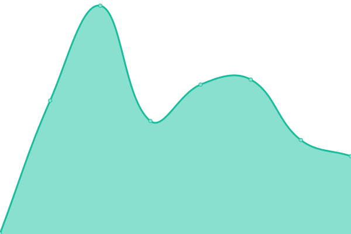

# [📈 Live Status](https://Comamoca.github.io/status): <!--live status--> **🟩 All systems operational**

This repository contains the open-source uptime monitor and status page for [Comamoca](https://Comamoca.github.io/status), powered by [Upptime](https://github.com/upptime/upptime).

With [Upptime](https://upptime.js.org), you can get your own unlimited and free uptime monitor and status page, powered entirely by a GitHub repository. We use [Issues](https://github.com/Comamoca/status/issues) as incident reports, [Actions](https://github.com/Comamoca/status/actions) as uptime monitors, and [Pages](https://Comamoca.github.io/status) for the status page.

<!--start: status pages-->
<!-- This summary is generated by Upptime (https://github.com/upptime/upptime) -->
<!-- Do not edit this manually, your changes will be overwritten -->
<!-- prettier-ignore -->
| URL | Status | History | Response Time | Uptime |
| --- | ------ | ------- | ------------- | ------ |
|  [Ablaze](https://ablaze.one) | 🟩 Up | [ablaze.yml](https://github.com/Comamoca/status/commits/HEAD/history/ablaze.yml) | 

 146ms
     
 | 

<a href="https://Comamoca.github.io/status/history/ablaze">100.00%</a>
    

|  [Ablaze Blog](https://blog.ablaze.one) | 🟩 Up | [ablaze-blog.yml](https://github.com/Comamoca/status/commits/HEAD/history/ablaze-blog.yml) | 

 1036ms
     
 | 

<a href="https://Comamoca.github.io/status/history/ablaze-blog">99.44%</a>
    

|  [emoji2svg](https://emoji2svg.deno.dev) | 🟩 Up | [emoji2svg.yml](https://github.com/Comamoca/status/commits/HEAD/history/emoji2svg.yml) | 

 359ms
     
 | 

<a href="https://Comamoca.github.io/status/history/emoji2svg">100.00%</a>
    

|  [blog](https://comamoca.dev) | 🟩 Up | [blog.yml](https://github.com/Comamoca/status/commits/HEAD/history/blog.yml) | 

 148ms
     
 | 

<a href="https://Comamoca.github.io/status/history/blog">100.00%</a>
    

<!--end: status pages-->

> **Note**
> The information provided on this status page **is unofficial.** > [Here](https://status.ablaze.one) is the official status page for the site, powered by Ablaze

[**Visit our status website →**](https://Comamoca.github.io/status)

## 📄 License

- Powered by: [Upptime](https://github.com/upptime/upptime)
- Code: [MIT](./LICENSE) © [Comamoca](https://Comamoca.github.io/status)
- Data in the `./history` directory: [Open Database License](https://opendatacommons.org/licenses/odbl/1-0/)
